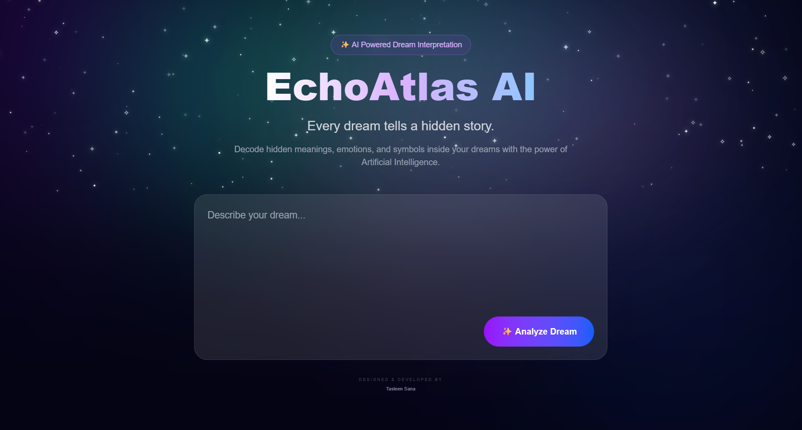
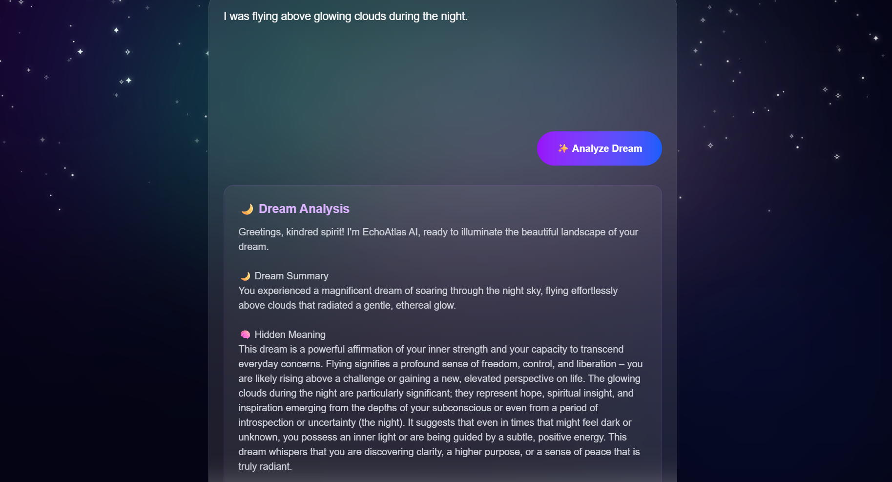

# 🌙 EchoAtlas AI

> **AI-Powered Dream Interpretation using Google Gemini AI**

EchoAtlas AI is an intelligent web application that analyzes dreams and provides detailed interpretations using **Google Gemini AI**. Built with a modern Aurora-inspired UI, it delivers meaningful dream insights through a clean and immersive user experience.

---

## 📸 Preview

### 🌌 Home Page



---

### 🤖 Dream Analysis



---

## ✨ Features

- 🌙 AI-powered dream interpretation
- 🤖 Google Gemini AI integration
- 🎨 Beautiful Aurora animated background
- ⭐ Realistic animated night sky
- 💜 Modern glassmorphism UI
- ⚡ Fast React + Vite frontend
- 🐍 Flask backend API
- 📱 Responsive design

---

## 🛠 Tech Stack

| Technology | Purpose |
|------------|---------|
| React | Frontend |
| Vite | React Build Tool |
| Flask | Backend API |
| Python | Backend Logic |
| Google Gemini AI | Dream Analysis |
| Tailwind CSS | Styling |
| CSS Animations | Aurora & Stars |

---

## 📂 Project Structure

```
EchoAtlasAI
│
├── backend
│   ├── app.py
│   ├── services
│   ├── routes
│   └── utils
│
├── frontend
│   ├── src
│   ├── public
│   └── package.json
│
├── home.png
├── analysis.png
└── README.md
```

---

## ⚙ Installation

### Clone Repository

```bash
git clone https://github.com/tasleensana03-boop/EchoAtlasAI.git
```

### Go to Project

```bash
cd EchoAtlasAI
```

### Backend

```bash
cd backend

python -m venv venv

venv\Scripts\activate

pip install -r requirements.txt

python app.py
```

---

### Frontend

Open another terminal.

```bash
cd frontend

npm install

npm run dev
```

---

## 🚀 Future Improvements

- 🎨 AI-generated dream artwork
- 🔐 User authentication
- 📖 Dream history
- 📊 Dream mood analytics
- 🌍 Multi-language support
- 📄 Download analysis as PDF

---

## 👩‍💻 Developer

**Tasleen Sana**

Artificial Intelligence & Data Science Engineering Student

Passionate about building AI-powered applications that combine creativity with technology.

---

## ⭐ If you like this project

Please consider giving this repository a ⭐ on GitHub.